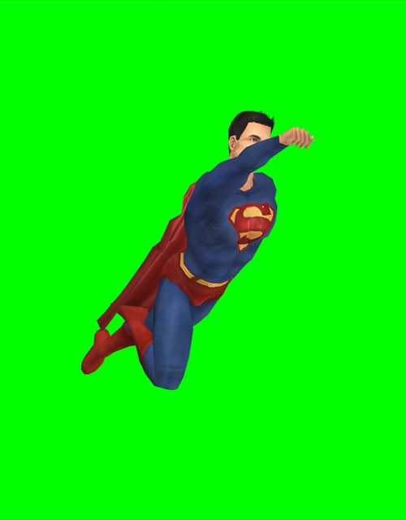
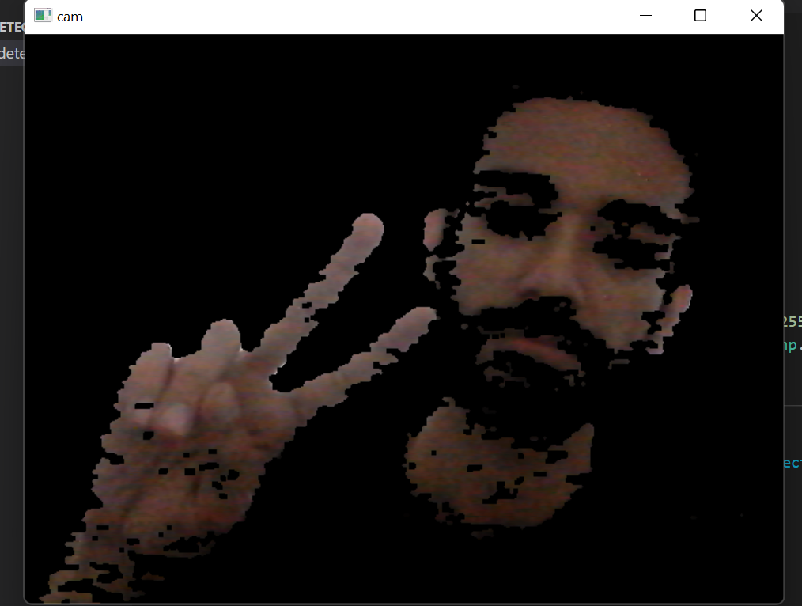

## Blue Screen Technique
- placing sky behind superman with blue screen technique.
- This code is written in **python** using **opencv**, **numpy**, **matplotlib**.
> 

## Skin Detection
- finding skin-colored pixels and regions in an image or a video. This process is typically used as a preprocessing step to find regions that potentially have human faces and limbs in images.
- This program is written in **python-opencv** using *HSV* & *YCbCr* color space.
> 